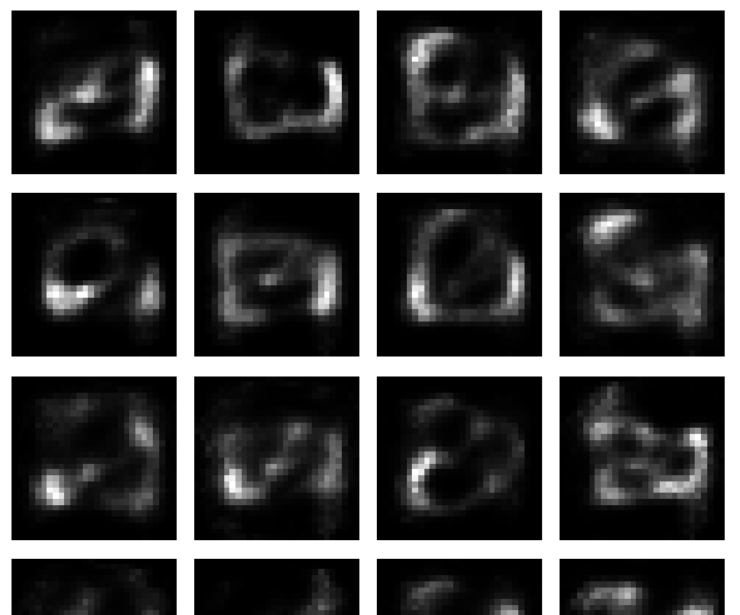

   # Week 1 — Introduction to Generative AI
   Lab 1: VAE vs GAN, mode collapse, FID evaluation

   # Week 1 — Introduction to Generative AI

## Lab 1 — VAE vs GAN

This lab explores two generative models: Variational Autoencoder (VAE) and Generative Adversarial Network (GAN) using the MNIST dataset.

## Experiments

### VAE
- Trained a VAE on MNIST.
- Generated new handwritten digit images from the latent space.
- Explored the effect of latent dimensions and KL divergence.

### GAN
- Trained a balanced GAN on MNIST.
- Increased the Discriminator learning rate by 10x to intentionally trigger mode collapse.
- Compared the generated samples before and after mode collapse.

## FID Results

| Model | FID |
|---|---:|
| VAE | 258.90 |
| Balanced GAN | 399.22 |
| Collapsed GAN | 359.09 |

Lower FID means that the distribution of generated images is closer to the distribution of real images.

In this experiment, the VAE had the lowest FID. The collapsed GAN had a lower FID than the balanced GAN, even though the generated images showed lower visual diversity. This demonstrates that FID alone does not fully measure diversity or mode collapse.

## Best Generated Image Grid

## Notebook

The complete lab notebook, code, outputs, FID calculations, and reflections are available in:

`lab1.ipynb`
